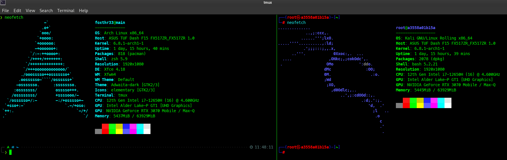

# Build a Custom Kali Docker Image

Need a quick Kali Linux instance but don't want the overhead of hypervisor virtualization? Build a custom headless image from a dockerfile and spin up an instance on your host machine using docker instead.

None of the tools come pre-installed on the docker images provided by Kali and require metapackage and additional tool installation along with further customization to meet your individual needs. This repo provides an example of how to build a custom image that natively includes all of the tools and customization you want each time a container is created from it.

## Building Images

1. Edit the `Dockerfile` as necessary to include any specific tools and customization you want.

2. Ensure you have `docker buildx` installed.

3. run `$ docker buildx build -t IMAGE_NAME .` in the same directory as the dockerfile where `IMAGE_NAME` is whatever you want your base image to be called (e.g., `kali_base`).

Whenever you want to build a fresh updated  image, simply clear the buildx cache with `$ docker buildx prune --all` or run the above command including the `--no-cache` flag.

### Useful Examples:

* `$ docker run --rm -it --network host -v $(pwd):/root/shared kali_base` runs a container with access to the host machine's network stack, shares the current host working directory with the container then deletes itself once the initial shell is exited.

* `$ docker run -it --network host -v $(pwd):/root/shared --privileged --name kali_instance kali_base` runs a container that provides the same functionality as above but additionally provides the container with direct access to host hardware and persists after exiting for later use.

### Note

* The initial image building process, especially if you include lots of tools, can take some time and will require a sizeable amount of storage (the build in this repo takes about 12.5 GB).

* When editing or creating your own docker file, make sure to include the lines that set/unset the `DEBIAN_FRONTEND` environment variable to and from `noninteractive` as demonstrated in the including dockerfile. This ensures that no user interaction is required during the bulid process which would cause the build to fail otherwise.